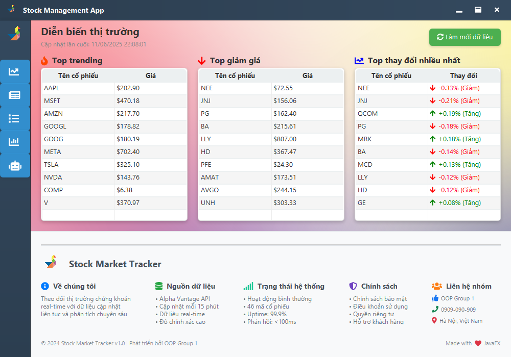

# Ứng Dụng Phân Tích và Theo Dõi Thị Trường Chứng Khoán

---

## 0. Giới Thiệu

### Phát Biểu Bài Toán

Trong bối cảnh thị trường chứng khoán biến động không ngừng, nhà đầu tư cá nhân thường đối mặt với những thách thức lớn:
- **Quá tải thông tin:** Vô số tin tức, dữ liệu và chỉ số được cập nhật liên tục từ nhiều nguồn khác nhau.
- **Khó khăn trong việc theo dõi:** Việc giám sát danh mục đầu tư, các cổ phiếu tiềm năng và các chỉ số quan trọng đòi hỏi nhiều thời gian và công sức.
- **Thiếu công cụ phân tích trực quan:** Các công cụ có sẵn thường phức tạp, không thân thiện với người dùng hoặc không tích hợp đủ các tính năng cần thiết.
- **Cần một trợ lý thông minh:** Nhu cầu có một công cụ có thể trả lời các câu hỏi, cung cấp thông tin nhanh và phân tích dữ liệu một cách tự động ngày càng trở nên cấp thiết.

### Ý Tưởng và Giải Pháp

Dự án này được xây dựng nhằm giải quyết các vấn đề trên bằng cách phát triển một ứng dụng Desktop (sử dụng JavaFX) toàn diện, thân thiện và mạnh mẽ. Ứng dụng đóng vai trò là một trung tâm chỉ huy cho nhà đầu tư, cung cấp các tính năng cốt lõi:

- **Tổng hợp dữ liệu đa nguồn:** Tự động lấy dữ liệu giá cổ phiếu real-time và tin tức thị trường từ các API uy tín (Alpha Vantage).
- **Trực quan hóa thông minh:** Biểu diễn dữ liệu dưới dạng biểu đồ đường, bảng biểu dễ hiểu, giúp người dùng nhanh chóng nắm bắt xu hướng.
- **Phân tích và xếp hạng:** Cung cấp các bảng xếp hạng "Top Trending", "Top Giảm Giá", và "Top Thay Đổi Nhiều Nhất" để làm nổi bật các cổ phiếu đáng chú ý.
- **Quản lý cá nhân hóa:** Cho phép người dùng tạo và quản lý "Danh sách theo dõi" (Watchlist) của riêng mình.
- **Trợ lý AI Chatbot:** Tích hợp Chatbot thông minh (sử dụng Gemini API) để trả lời các câu hỏi, phân tích và cung cấp thông tin theo yêu cầu.
- **Giao diện hiện đại:** Thiết kế giao diện người dùng tùy chỉnh, đồng bộ và đẹp mắt, nâng cao trải nghiệm người dùng.

---

## 1. Tổng Quan

### 1.1. Sơ Lược Về Dự Án

Đây là một ứng dụng Desktop được xây dựng hoàn toàn bằng Java và JavaFX, tuân thủ chặt chẽ các nguyên tắc của Lập trình Hướng đối tượng (OOP). Dự án được cấu trúc theo mô hình kiến trúc **Model-View-Controller (MVC)**, giúp mã nguồn trở nên dễ bảo trì, mở rộng và kiểm thử.

### 1.2. Các Lớp Chính Trong Dự Án

Dự án được tổ chức thành các package có chức năng riêng biệt, tương ứng với các thành phần của MVC:

- **`oop.grp1.GUI` (View):**
  - Chịu trách nhiệm hiển thị giao diện người dùng (UI) và nhận tương tác từ người dùng.
  - `Main.java`, `MainLayout.java`, `TrendingstocksPage.java`, `NewsPage.java`, `StockDetail.java`, `ViewStockDetail.java`, `ChatbotPage.java`, và các lớp giao diện khác.

- **`oop.grp1.Control` (Controller):**
  - Đóng vai trò trung gian, xử lý logic nghiệp vụ, nhận yêu cầu từ View và cập nhật Model.
  - **`DataFetcher` Package:** Các lớp `StockDF`, `NewsDF` lấy dữ liệu từ API.
  - **`DBManager` Package (DAO):** Các lớp `*Manager` xử lý các thao tác với cơ sở dữ liệu.
  - `Chatbot.java`: Xử lý logic cho chatbot.

- **`oop.grp1.Model` (Model):**
  - Đại diện cho cấu trúc dữ liệu của ứng dụng.
  - `Stock.java`, `News.java`, `ChatResponse.java`: Các lớp định nghĩa đối tượng dữ liệu.

### 1.3. Các Yếu Tố Hướng Đối Tượng Trong Dự Án

- **Tính Trừu Tượng (Abstraction):**
  - Lớp `DFAbstract` là một ví dụ điển hình, nó định nghĩa một "hợp đồng" chung cho việc lấy dữ liệu (`fetch`) mà không cần quan tâm đến việc dữ liệu đó là tin tức hay giá cổ phiếu. Các lớp con sẽ cung cấp cách triển khai cụ thể.
- **Tính Kế Thừa (Inheritance):**
  - `StockDF` và `NewsDF` kế thừa từ `DFAbstract`.
  - Các lớp `*Manager` kế thừa từ `DBManager`.
  - Hầu hết các lớp trong `GUI` đều kế thừa từ các lớp cơ sở của JavaFX như `VBox`, `HBox`, `BorderPane`.
- **Tính Đa Hình (Polymorphism):**
  - `PageManager` quản lý một tập hợp các `Node` (là các trang khác nhau) và hiển thị chúng mà không cần biết kiểu cụ thể của trang đó là gì.
  - Đối tượng `DFAbstract` có thể tham chiếu đến một đối tượng `StockDF` hoặc `NewsDF` tại thời điểm chạy.
- **Tính Đóng Gói (Encapsulation):**
  - Các lớp trong `Model` (`Stock`, `News`) đóng gói dữ liệu bằng cách sử dụng các thuộc tính `private` và cung cấp các phương thức `public` (getters/setters) để truy cập, đảm bảo tính toàn vẹn của dữ liệu.
- **Mẫu Thiết Kế (Design Patterns):**
  - **Singleton:** `PageManager` được thiết kế theo mẫu Singleton để đảm bảo chỉ có một thực thể duy nhất quản lý các trang trong toàn bộ ứng dụng.
  - **DAO (Data Access Object):** Các lớp `*Manager` trong package `DBManager` hoạt động như các DAO, tách biệt hoàn toàn logic truy cập dữ liệu ra khỏi logic nghiệp vụ chính.
  - **Model-View-Controller (MVC):** Dự án tuân thủ chặt chẽ mô hình này để phân tách các mối quan tâm:
    - **Model:** Gói `oop.grp1.Model` định nghĩa các đối tượng dữ liệu.
    - **View:** Gói `oop.grp1.GUI` xây dựng giao diện người dùng.
    - **Controller:** Gói `oop.grp1.Control` xử lý logic và luồng dữ liệu.

---

## 2. Nội Dung

### 2.1. Sơ Đồ Usecase


- **Actor:** Người dùng (Nhà đầu tư)
- **Use Cases:**
  - **Xem Diễn Biến Thị Trường:** Xem các bảng Top Trending, Top Giảm Giá, Top Thay Đổi.
  - **Xem Tin Tức:**
    - Xem danh sách tin tức mới nhất.
    - Tìm kiếm tin tức theo tiêu đề hoặc mã cổ phiếu.
    - Đọc chi tiết tin tức trong một cửa sổ riêng.
    - Làm mới dữ liệu tin tức.
  - **Xem Danh Sách Cổ Phiếu:**
    - Xem danh sách tất cả các cổ phiếu được hỗ trợ.
    - Thêm/Xóa cổ phiếu khỏi Watchlist.
    - Tìm kiếm cổ phiếu theo mã.
  - **Xem Chi Tiết Cổ Phiếu:**
    - Chọn một cổ phiếu để xem biểu đồ giá và khối lượng giao dịch chi tiết.
    - Tương tác với biểu đồ để xem thông tin tại một điểm thời gian cụ thể.
  - **Tương Tác Với Chatbot:**
    - Gửi câu hỏi về thị trường, cổ phiếu hoặc các khái niệm.
    - Xem lịch sử cuộc trò chuyện.
  - **Tùy Chỉnh Cửa Sổ:**
    - Di chuyển, đóng, thu nhỏ, phóng to cửa sổ ứng dụng.

### 2.2. Sơ Đồ Lớp (Class Diagram)


- **Quan Hệ Thừa Kế:**
  - `StockDF`, `NewsDF` -> `DFAbstract`
  - `StockManager`, `NewsManager`, `ChatbotManager` -> `DBManager`
- **Quan Hệ Tổng Hợp (Aggregation/Composition):**
  - `MainLayout` chứa `CustomTitleBar`, `Sidebar`, `StackPane` (contentArea).
  - `Sidebar` chứa các `Button`.
  - Các trang (`*Page`) chứa các thành phần JavaFX (TableView, Button, Label, ...).
- **Quan Hệ Phụ Thuộc (Dependency):**
  - `PageManager` phụ thuộc vào các lớp `*Page` để tạo và hiển thị chúng.
  - Các lớp `GUI` phụ thuộc vào các lớp `*Manager` và `*DF` để lấy và hiển thị dữ liệu.
  - Các lớp `Control` phụ thuộc vào các lớp `Model` để định hình dữ liệu.
  - `ChatbotPage` phụ thuộc vào `MarkdownUtils` để render HTML.

### 2.3. Thiết Kế Cơ Sở Dữ Liệu

Ứng dụng sử dụng **SQLite** làm cơ sở dữ liệu cục bộ để lưu trữ dữ liệu, giúp ứng dụng có thể hoạt động offline và tăng tốc độ truy vấn.

- **Bảng `stocks`:** Lưu trữ dữ liệu lịch sử giá của cổ phiếu.
  - `ticker` (TEXT, PRIMARY KEY): Mã cổ phiếu.
  - `timestamp` (TEXT, PRIMARY KEY): Mốc thời gian.
  - `open` (REAL): Giá mở cửa.
  - `high` (REAL): Giá cao nhất.
  - `low` (REAL): Giá thấp nhất.
  - `close` (REAL): Giá đóng cửa.
  - `volume` (INTEGER): Khối lượng giao dịch.

- **Bảng `news`:** Lưu trữ tin tức đã được lấy về.
  - `url` (TEXT, PRIMARY KEY): URL duy nhất của bài báo.
  - `title` (TEXT): Tiêu đề.
  - `summary` (TEXT): Tóm tắt.
  - `source` (TEXT): Nguồn tin.
  - `time_published` (TEXT): Thời gian xuất bản.
  - `overall_sentiment_score` (REAL): Điểm cảm xúc tổng thể.
  - `overall_sentiment_label` (TEXT): Nhãn cảm xúc (Bullish, Bearish, Neutral).
  - `tickers` (TEXT): Các mã cổ phiếu liên quan (dạng JSON array).
  - `topics` (TEXT): Các chủ đề liên quan (dạng JSON array).

- **Bảng `chat_history`:** Lưu trữ lịch sử trò chuyện với Chatbot.
  - `id` (INTEGER, PRIMARY KEY AUTOINCREMENT): ID duy nhất.
  - `session` (TEXT): Mã phiên trò chuyện.
  - `user_query` (TEXT): Câu hỏi của người dùng.
  - `response_content` (TEXT): Câu trả lời của bot.
  - `timestamp` (TEXT): Dấu thời gian.

### 2.4. Kiến Trúc MVC

Dự án áp dụng mô hình kiến trúc **Model-View-Controller (MVC)** để phân tách rõ ràng các thành phần của ứng dụng, tăng tính module hóa và dễ bảo trì:

1.  **Model (Mô hình):**
    -   **Vai trò:** Quản lý dữ liệu và logic nghiệp vụ của ứng dụng. Nó chứa trạng thái của ứng dụng (ví dụ: dữ liệu cổ phiếu, tin tức) và các quy tắc để thao tác trên dữ liệu đó. Model hoàn toàn không biết về giao diện người dùng.
    -   **Thành phần trong dự án:** Gói `oop.grp1.Model` (định nghĩa cấu trúc dữ liệu như `Stock`, `News`) và một phần của gói `oop.grp1.Control` (các lớp `*Manager` và `*DF` chịu trách nhiệm truy xuất và xử lý dữ liệu).

2.  **View (Giao diện):**
    -   **Vai trò:** Chịu trách nhiệm hiển thị dữ liệu từ Model cho người dùng và thu nhận các hành động của người dùng (nhấp chuột, nhập liệu). View không chứa logic nghiệp vụ.
    -   **Thành phần trong dự án:** Toàn bộ các lớp trong gói `oop.grp1.GUI` (ví dụ: `TrendingstocksPage`, `NewsPage`, `LineChart`, `TableView`).

3.  **Controller (Bộ điều khiển):**
    -   **Vai trò:** Đóng vai trò trung gian giữa Model và View. Nó nhận đầu vào từ người dùng (qua View), diễn giải chúng thành các hành động mà Model có thể hiểu và thực hiện. Sau khi Model thay đổi, Controller có thể cập nhật View tương ứng.
    -   **Thành phần trong dự án:** Gói `oop.grp1.Control` và các trình xử lý sự kiện (event handlers) được định nghĩa bên trong các lớp của `GUI`. Ví dụ, khi người dùng nhấp vào nút "Làm mới", một event handler trong View sẽ gọi một phương thức trong Controller, Controller sẽ yêu cầu Model lấy dữ liệu mới, sau đó cập nhật lại View.

### 2.5. Công Nghệ Sử Dụng

- **Ngôn ngữ lập trình:** Java (phiên bản 11 trở lên)
- **Giao diện người dùng (FE):**
  - **JavaFX:** Framework chính để xây dựng giao diện.
  - **CSS:** Tùy chỉnh giao diện, tạo hiệu ứng, màu sắc và bố cục.
  - **Ikonli:** Thư viện cung cấp các bộ icon (FontAwesome) cho JavaFX.

- **Back-end & Logic:**
  - **Gson:** Thư viện của Google để xử lý (phân tích và tạo) dữ liệu JSON.
  - **FlexMark:** Thư viện để chuyển đổi Markdown sang HTML.
  - **java-dotenv:** Thư viện để quản lý các biến môi trường từ tệp `.env`.
- **Cơ sở dữ liệu (DB):**
  - **SQLite:** Hệ quản trị cơ sở dữ liệu quan hệ gọn nhẹ, lưu trữ trong một tệp duy nhất.
  - **SQLite-JDBC:** Driver để kết nối Java với SQLite.
- **APIs bên ngoài:**
  - **Alpha Vantage API:** Cung cấp dữ liệu giá cổ phiếu và tin tức.
  - **Google Gemini API:** Cung cấp mô hình ngôn ngữ lớn cho tính năng Chatbot.

---

## 3. Hướng Dẫn Cài Đặt

1.  **Clone Repository:**
    ```bash
    git clone https://github.com/nqd1/StockApp
    cd StockApp
    ```
2.  **Cài đặt môi trường:**
    - Đảm bảo bạn đã cài đặt **JDK (Java Development Kit)** phiên bản 11 trở lên.
    - Đảm bảo bạn đã cài đặt **Apache Maven**.
3.  **Cấu hình biến môi trường:**
    - Tạo một tệp có tên `.env` ở thư mục gốc của dự án.
    - Thêm các khóa API và cấu hình cần thiết vào tệp này:
      ```env
      # URL kết nối tới cơ sở dữ liệu SQLite
      DB_URL=jdbc:sqlite:stockAV.db

      # Khóa API cho Alpha Vantage (dùng cho giá cổ phiếu)
      ALPHA_VANTAGE_API_KEY1=YOUR_ALPHA_VANTAGE_API_KEY_HERE

      # Khóa API cho Alpha Vantage (dùng cho tin tức)
      ALPHA_VANTAGE_API_KEY3=ANOTHER_ALPHA_VANTAGE_API_KEY_HERE

      # Khóa API cho Google Gemini (dùng cho Chatbot)
      GEMINI_API_KEY=YOUR_GEMINI_API_KEY_HERE
      ```
4.  **Build dự án:**
    - Mở terminal hoặc command prompt tại thư mục gốc và chạy lệnh sau để Maven tải các thư viện phụ thuộc và build dự án:
    ```bash
    mvn clean install
    ```
5.  **Chạy ứng dụng:**
    - Sau khi build thành công, bạn có thể chạy ứng dụng qua terminal bằng lệnh mvn javafx:run

---

## 4. Demo Giao Diện

**1. Giao diện chính và Trang Diễn Biến Thị Trường:**


**2. Trang Tin Tức với chức năng tìm kiếm:**


**3. Danh sách cổ phiếu và Quản lý Watchlist:**
 

**4. Biểu đồ chi tiết của một cổ phiếu:**


**5. Giao diện Chatbot AI:**


**6. Video Demo:**

### Xem Video Demo Ứng Dụng:

<iframe width="560" height="315" src="https://www.youtube.com/embed/EF6fqnnl3Uk?si=GeQqGZlpz6A-hx7m" title="YouTube video player" frameborder="0" allow="accelerometer; autoplay; clipboard-write; encrypted-media; gyroscope; picture-in-picture; web-share" referrerpolicy="strict-origin-when-cross-origin" allowfullscreen></iframe>

*Nếu video không hiển thị, bạn có thể xem trực tiếp tại: [RM/videos/demo.mp4](RM/videos/demo.mp4)*